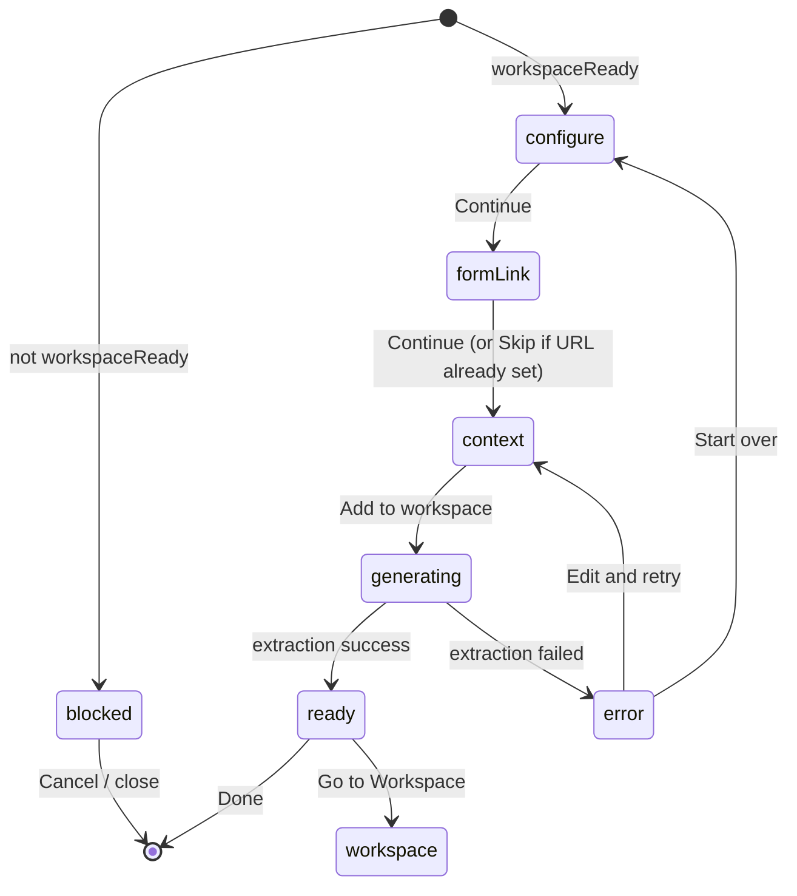

# Add to Workspace — interaction spec

Design and engineering reference for the **Add to my workspace** dialog and backend handoff.

**Status:** Spec for prototype iteration (frontend mock + future production)  
**Related:** [OPENSCIED-INGEST.md](./OPENSCIED-INGEST.md) · Evaluation checklist PDF (LangSmith prompt engineering)  
**Prototype today:** `src/components/AddToWorkspaceDialog.tsx` (2 steps: configure → confirm)

---

## Goal

Let an Eddo teacher take a **digitized OpenSciEd assessment** from the library into their Workspace so the **assessment tool** can generate **AI feedback** on student responses (not grades).

The teacher’s visible job:

1. Choose where to add the assessment
2. Connect their **district copy** of the Google Form
3. Optionally add **free-text classroom context**
4. Wait while Eddo **prepares** the assessment (reviewer instruction JSON)
5. Open Workspace when ready

The teacher never sees reviewer instruction JSON.

---

## Scope boundaries

| In scope | Out of scope (v1) |
| --- | --- |
| Feedback via per-criterion checklist (Yes/No + comments) | Point totals, holistic rubric levels, gradebook |
| Formal formative + summative assessments only | TE opportunity rows |
| Free-text teacher context at add time | Upload UI for rubric/key in library |
| LangSmith `assessment_extraction_checklist` on add | Pre-generating JSON at library ingest |

**Unchanged for now:** `isWorkspaceReady()` still requires **Google Form + answer key or rubric** (`src/lib/assessment-helpers.ts`). This gate means “library has the inputs needed to run extraction,” not “JSON already exists.”

---

## Architecture (two LangSmith prompts)

```text
Add to Workspace
      │
      ├─ Inputs (visible to teacher): district Form URL, free-text context
      ├─ Inputs (from catalog, hidden): student instruction, answer key/rubric
      │
      ▼
  assessment_extraction_checklist  →  reviewer instruction JSON
      │
      ▼
  Workspace assessment instance stored
      │
      ▼ (per student response, later)
  student-response-evaluation-feedback-and-checklist  →  checklist + feedback
```

Criterion IDs from extraction (e.g. `1B-1`) must **persist unchanged** into evaluation output.

---

## Dialog state machine



### Steps

| Step | ID | Purpose |
| --- | --- | --- |
| 0 | `blocked` | Assessment not workspace-ready — same amber alert as today |
| 1 | `configure` | Destination workspace + review catalog materials |
| 2 | `formLink` | Teacher duplicates Eddo Form and pastes their copy URL |
| 3 | `context` | Optional free-text classroom context |
| 4 | `generating` | Backend runs extraction; dialog shows progress |
| 5 | `ready` | Success summary + CTA to Workspace |
| 6 | `error` | Extraction failed — retry or edit inputs |

**Prototype shortcut:** Steps 1–3 can be collapsed into a single `configure` screen with form URL + context fields until UX is validated. Production should use the full sequence.

---

## Step-by-step copy and behavior

### Step 0 — Blocked (not workspace-ready)

**When:** `!isWorkspaceReady(assessment)` — user opened dialog from a path that bypasses the disabled button (edge case) or readiness changes mid-session.

**UI:** Existing amber alert.

| Element | Copy |
| --- | --- |
| Title | Not yet digitized for Workspace |
| Body | This assessment is missing a Google Form or scoring materials. You can still export the handout materials. |
| Primary | Close |

**Note for PM:** Long-term, “digitized” may mean form-only; gate logic is intentionally unchanged in this spec.

---

### Step 1 — Configure

**Title:** Add to my workspace  

**Description:** Set up **{assessment.title}** in Eddo Workspace for AI-assisted feedback on student responses.

#### Destination

- Select: mock workspaces today (`MOCK_WORKSPACES`); real user workspaces in production.
- Label: **Destination**
- Helper: Choose the class or workspace where you will collect responses.

#### Included from library

Section label: **Included from OpenSciEd / Eddo**

List available package items (same as today via `getWorkspaceAttachItems`):

- Google Form (Eddo template)
- Answer key (recommended)
- Rubric (when applicable)

Helper text:

> These materials are used to prepare feedback criteria. You will make your own copy of the Google Form in the next step.

**Do not list:** reviewer instruction JSON, LangSmith, or “evaluation checklist.”

#### Footer

| Control | Label | Action |
| --- | --- | --- |
| Secondary | Cancel | Close dialog, reset state |
| Primary | Continue | → `formLink` |

Primary disabled when `!workspaceReady`.

---

### Step 2 — Connect your Google Form

**Title:** Connect your Google Form  

**Description:** Duplicate the Eddo form into your school Google account, then paste the link to **your copy** below.

#### Instructions (numbered)

1. Open the **Eddo template form** (link opens new tab — use catalog `google-form` URL).
2. In Google Forms: **Make a copy** (File → Make a copy, or Forms UI equivalent).
3. Paste the URL of **your district copy** here.

#### Form URL field

- Label: **Your form URL**
- Placeholder: `https://docs.google.com/forms/d/…`
- Validation: non-empty, matches Google Forms URL pattern (prototype: loose check).
- Error: Enter a valid Google Forms link to your copy.

#### Optional preview

- Link: **Preview Eddo template** (opens library form preview / live form).

#### Footer

| Control | Label | Action |
| --- | --- | --- |
| Secondary | Back | → `configure` |
| Primary | Continue | → `context` (disabled until valid URL) |

---

### Step 3 — Classroom context (optional)

**Title:** Add classroom context (optional)  

**Description:** Tell us anything specific about how you taught this lesson. This helps tailor feedback to your class.

#### Free-text area

- Label: **Your context**
- Placeholder example: *We did the ruler and marker demo but not the laser activity. Students struggled with amplitude vs. frequency.*
- Max length: suggest 2,000 characters (prototype: no hard limit).
- Helper: Optional. You can change this later in Workspace.

**Backend:** Passed into `assessment_extraction_checklist` when the prompt supports it (not in Raymond’s PDF v1 — flag for eng).

#### Footer

| Control | Label | Action |
| --- | --- | --- |
| Secondary | Back | → `formLink` |
| Tertiary | Skip | → `generating` with empty context |
| Primary | Add to workspace | → `generating` |

---

### Step 4 — Generating

**Title:** Preparing your assessment…  

**Description:** Building feedback criteria from OpenSciEd materials. This usually takes under a minute.

**UI:**

- Indeterminate progress indicator (spinner or progress bar).
- Do not expose LangSmith, JSON, or criterion IDs.
- Dialog is **not dismissible** except Cancel (with confirm: “Preparation in progress. Cancel anyway?”).

**Backend (production):**

1. Load student instruction (from digitized form / handout).
2. Load answer key and/or rubric from catalog paths.
3. Append teacher free-text context.
4. Run `assessment_extraction_checklist`.
5. Persist JSON on workspace assessment record.
6. Store `confidence` and `errors` for support/QA — not shown to teacher unless failure.

**Prototype:** `setTimeout` ~2–3s then → `ready`; or stub success immediately.

**On success:** → `ready`  
**On failure:** → `error`

---

### Step 5 — Ready

**Title:** Ready for feedback  

**Description:** **{assessment.title}** is set up in **{destination}**. Open Workspace to share your form and review student work.

#### Summary card

| Field | Value |
| --- | --- |
| Assessment | {title} · {lesson} |
| Destination | {workspace label} |
| Connected form | Truncated URL or “Your Google Form copy” |
| Context | “Added” or “None” |

**Do not show:** JSON, criterion count, confidence score.

#### Footer

| Control | Label | Action |
| --- | --- | --- |
| Secondary | Done | Close dialog |
| Primary | Go to Workspace | Navigate to workspace assessment (stub: toast today) |

**Copy note:** Say **feedback**, not scoring or grading.

---

### Step 6 — Error

**Title:** Couldn’t prepare this assessment  

**Description:** Something went wrong while building feedback criteria. You can try again or edit your form link and context.

**UI:**

- Generic message for teachers (no stack traces, no `errors[]` dump).
- Optional: “Contact support” with assessment ID.

#### Footer

| Control | Label | Action |
| --- | --- | --- |
| Secondary | Cancel | Close |
| Primary | Try again | → `generating` |
| Tertiary | Edit details | → `context` |

---

## What the teacher does vs what Eddo does

| Actor | Action |
| --- | --- |
| **Teacher** | Duplicate Google Form to district domain |
| **Teacher** | Paste form URL |
| **Teacher** | Optional free-text context |
| **Eddo (catalog)** | Provides form template, answer key, rubric |
| **Eddo (on add)** | Runs extraction → reviewer instruction JSON |
| **Eddo (Workspace)** | Evaluates responses → checklist + feedback |

---

## Relationship to library surfaces

| Surface | Role |
| --- | --- |
| **Assessment guide** panel (detail page) | Human-readable prep for teachers; **separate** from reviewer JSON |
| **Export** | Free path — full material bundle to Drive |
| **Add to Workspace** | Eddo path — form + hidden JSON prep + feedback tool |
| **`isWorkspaceReady`** | Controls button visibility; unchanged in this spec |

---

## Entry points (unchanged)

- Assessment detail footer: **Add to Eddo workspace**
- Table row action (when ready)
- Auth gate: unauthenticated users → sign-in → return with `?action=add-workspace` (`use-add-to-workspace-gate.ts`)

Dialog opens only after auth when triggered from gate.

---

## Prototype implementation checklist

Use this when building the mock in `AddToWorkspaceDialog.tsx`:

- [ ] Extend `step` union: `configure` \| `formLink` \| `context` \| `generating` \| `ready` \| `error`
- [ ] Add local state: `formUrl`, `teacherContext`
- [ ] Step 1: rename “Will attach” → “Included from OpenSciEd / Eddo”; update helper copy
- [ ] Step 2: form URL input + template link from `google-form` package item
- [ ] Step 3: textarea + Skip
- [ ] Step 4: spinner + mock delay; call `addToWorkspace()` on success
- [ ] Step 5: summary includes form URL + context flag; **Go to Workspace** stub
- [ ] Step 6: generic error + retry
- [ ] Reset all state on dialog close
- [ ] Keep `isWorkspaceReady` and `getWorkspaceAttachItems` as-is
- [ ] Do not add JSON or “evaluation checklist” to attach list

---

## Production follow-ups (not prototype)

| Item | Owner |
| --- | --- |
| Automate `assessment_extraction_checklist` API on add | Eng |
| Pass `teacherContext` into LangSmith prompt | Eng / Raymond |
| JSON shortening for complex summatives (Alaska pattern) | Eng |
| Form URL → question ID mapping validation | Eng |
| Relax `isWorkspaceReady` to form-only (if PM decides) | Product + Eng |
| Editable context in Workspace after add | Product |

---

## Copy glossary

| Prefer | Avoid |
| --- | --- |
| AI-assisted **feedback** | AI-assisted scoring, grading |
| **Prepare** / **Ready for feedback** | Generate rubric, extract JSON |
| **Your Google Form copy** | Reviewer instructions, LangSmith |
| **Classroom context** | Prompt engineering, teacher overrides |
| **Included from library** | Attached (implies teacher uploaded) |

---

*Last updated from product discovery: LangSmith evaluation checklist PDF, Add to Workspace funnel discussion.*
