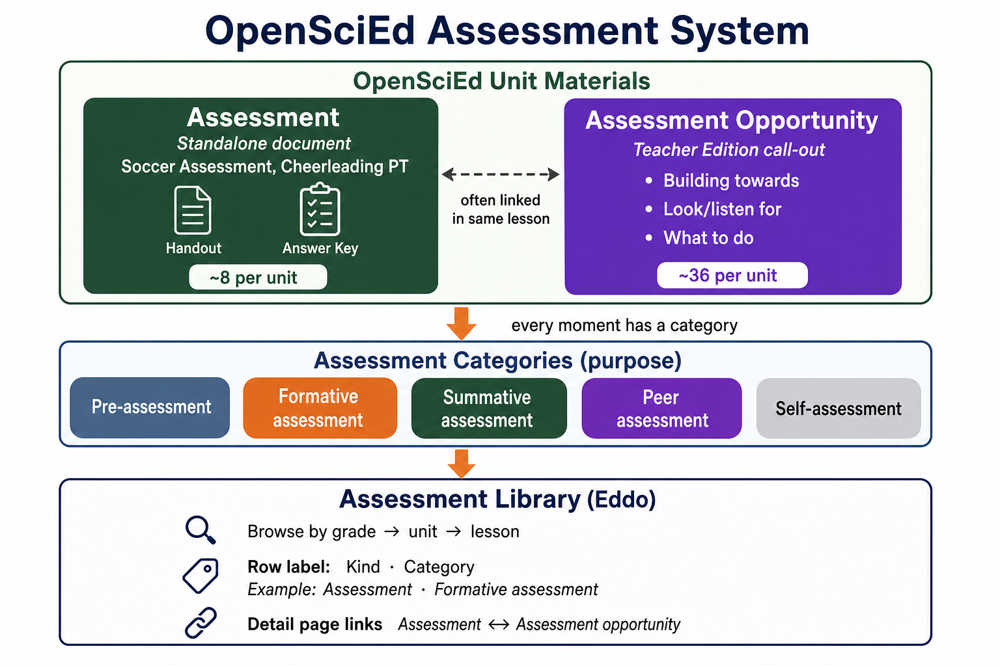

# OpenSciEd assessment system — PRD explainer

Copy-paste section for product docs. Sources: [OpenSciEd knowledge base](https://openscied.org/knowledge/what-type-of-assessments-are-available-in-an-openscied-unit/), [Assessment System 101](https://openscied.org/on-demand-hub/ose-assessment-system-101/), and our ingest of Unit 8.1.



---

## For the PRD (short version)

OpenSciEd units ship with an **assessment system**, not a pile of disconnected worksheets. Assessments are embedded in the instructional model — they support sensemaking, revision, and collaboration — and are designed to work together so teachers can monitor and adjust instruction across a unit.

Teachers encounter assessments in **two forms**:

1. **Assessments** — standalone documents in the unit download (student handout, answer key, sometimes rubric). Example: *Soccer Assessment* in Unit 8.1 Lesson 6. There are typically **~8 per middle-school unit**.
2. **Assessment opportunities** — call-outs inside the Teacher Edition lesson plan, labeled **ASSESSMENT OPPORTUNITY**, with *Building towards*, *What to look/listen for*, and *What to do*. These are used **while teaching**. There are typically **~30–40 per unit**.

Every assessment moment also has a **category** that describes its purpose in the system:

| Category | Purpose | Typical timing |
| --- | --- | --- |
| **Pre-assessment** | Surface prior ideas before new instruction | Early in a lesson set |
| **Formative assessment** | Monitor learning and adjust during instruction | Throughout every lesson |
| **Summative assessment** | Evaluate learning at a point in time | End of lesson set or unit |
| **Peer assessment** | Students give or receive feedback from peers | When designs or arguments are shared |
| **Self-assessment** | Students reflect on their own progress | Reflection checkpoints |

The **Assessment Overview Table** at the start of each unit’s Teacher Edition lists key moments and maps them to these categories. Rubrics or answer keys are provided for those key points.

**What the Assessment Library does:** organizes both forms by **grade → unit → lesson**, preserves OpenSciEd terminology, surfaces the category on every row, and links standalone **Assessments** to their related **Assessment opportunities** so teachers see facilitation guidance and materials in one place.

---

## For the PRD (one paragraph)

OpenSciEd embeds a coherent **assessment system** in each unit: pre-, formative, summative, peer, and self assessments that work together across lessons. Teachers find them either as **Assessments** (standalone handouts and keys in the unit download) or as **Assessment opportunities** (Teacher Edition call-outs used during instruction). The Assessment Library mirrors that structure — lesson-ordered catalog, OpenSciEd labels, category on every row, and linked detail pages — so coaches and teachers can find the right moment and materials without digging through Drive folders.

---

## How the two forms relate (Unit 8.1 example)

```
Unit 8.1 Contact Forces
├── Assessment Overview Table (TE)     ← map of key moments by category
├── ~36 Assessment opportunities       ← TE call-outs across 16 lessons
└── 8 Assessments                      ← Soccer, Baseball 1 & 2, Cheerleading…
         │
         └── often linked ──► matching Assessment opportunity in same lesson
                               (e.g. Soccer handout ↔ TE facilitation for Lesson 6)
```

| Lesson | Assessment (document) | Linked assessment opportunity |
| --- | --- | --- |
| 6 | Soccer Assessment | Soccer assessment (in TE block) |
| 10 | Baseball Assessment 1 & 2 | Matching TE opportunities |
| 15 | Cheerleading Performance Task (Parts 1 & 2) | Summative TE blocks |

Not every assessment opportunity has a standalone document — most are guidance-only during the lesson. Not every assessment opportunity is duplicated as a document row; ingest deduplicates when the handout is already an Assessment.

---

## What Eddo adds (scope boundary)

| Layer | Source | In library today |
| --- | --- | --- |
| **Assessment opportunity** facilitation | OpenSciEd TE (verbatim scrape) | Yes — detail page “From Teacher Edition” |
| **Assessment** materials | OpenSciEd unit download | Yes — handout, key, guide links |
| **Assessment guide** | Eddo-generated at ingest from TE + key | Yes — alignment, strong/emerging/gaps |
| Export to Drive / Workspace | Eddo product | Prototype stubs |

---

## Terminology cheat sheet

| Say in product UI | Do not say | Ingest `source` |
| --- | --- | --- |
| Assessment | Named assessment, formal assessment | `formal-assessment` |
| Assessment opportunity | TE opportunity, TE row | `te-opportunity` |
| Formative / Summative / etc. | Type, kind (alone) | `assessmentType` |

---

## Reference links

- [What type of assessments are available in an OpenSciEd unit?](https://openscied.org/knowledge/what-type-of-assessments-are-available-in-an-openscied-unit/)
- [Are rubrics and answer keys available?](https://openscied.org/knowledge/are-rubrics-and-answer-keys-available-for-the-assessments/)
- [Assessment System 101 (PL)](https://openscied.org/on-demand-hub/ose-assessment-system-101/)
