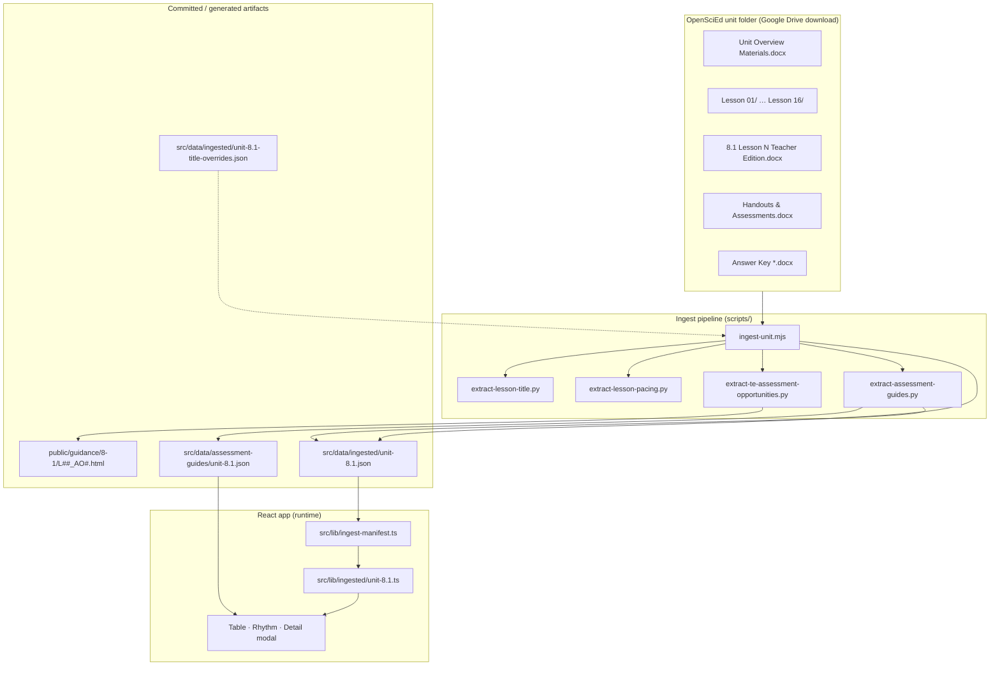
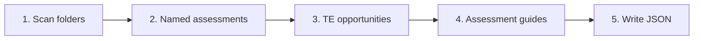
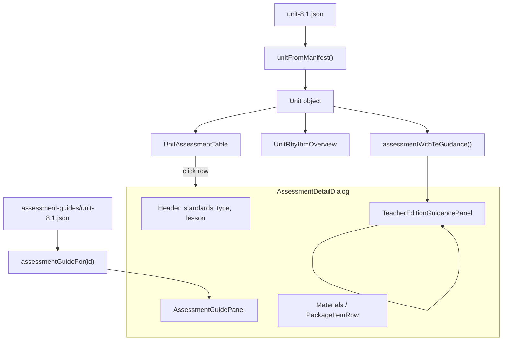
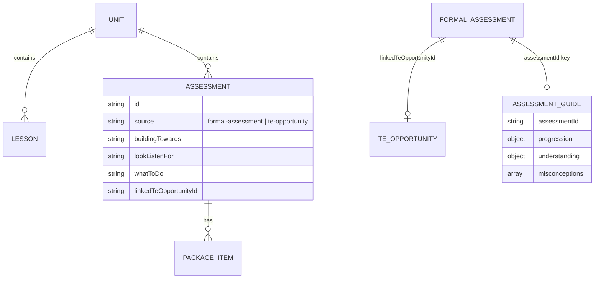

# OpenSciEd Google Drive → Assessment Library

Developer guide for how unit materials from the OpenSciEd download (Google Drive folder) are ingested, stored, and rendered in the prototype app.

> **Quick start:** [ONBOARDING.md](./ONBOARDING.md) · **View graphs:** open [diagrams.html](./diagrams.html) in a browser · **Overview image:** [openscied-ingest-architecture.png](./openscied-ingest-architecture.png)

**Prototype reference unit:** Grade 8 · Unit 8.1 Contact Forces  
**Primary command:**

```bash
node scripts/ingest-unit.mjs "/path/to/8.1 Contact Forces" src/data/ingested/unit-8.1.json
```

Requires **Python 3** (stdlib only — no pip packages) and **Node 18+**.

---

## 1. System overview



**Key idea:** Teachers browse a **structured catalog** built from Drive files. Nothing in the table is hand-typed prose — it is extracted, classified, and optionally QA-patched.

---

## 2. Expected Google Drive folder layout

The ingest script expects the **Grade 8 unit download** layout (local sync of OpenSciEd materials):

```text
8.1 Contact Forces/
├── 8.1 Unit Overview Materials.docx      ← lesson pacing (days per lesson)
├── Lesson 1 - 8.1 Contact Forces/
│   ├── 8.1 Lesson 1 Teacher Edition.docx ← TE scrape source
│   ├── 8.1 Lesson 1 Handout ….docx
│   └── …
├── Lesson 6 - 8.1 Contact Forces/
│   ├── 8.1 Lesson 6 Teacher Edition.docx
│   ├── 8.1 Lesson 6 Assessment Soccer Assessment.docx   ← named assessment
│   ├── 8.1 Lesson 6 Answer Key Soccer Assessment Key.docx
│   └── …
└── Lesson N …
```

**File naming conventions the scanner relies on:**

| Pattern | Used for |
|--------|----------|
| `Lesson N - …/` | Lesson folders (sorted by N) |
| `8.1 Lesson N …` + English (not `Lección`) | File filter |
| `Teacher Edition` | TE docx for opportunity scrape + lesson title |
| `Assessment` (not Answer Key) | Named formal assessments |
| `Answer Key` | Keys matched to assessments |
| `Handout` | Extra handout-based assessments (L7, L8, L14) |
| `Unit Overview Materials` | Pacing extract |

Spanish duplicate files are ignored via the `Lección` filter in `ingest-unit.mjs`.

---

## 3. Ingest pipeline (step by step)



### Step 1 — Unit & lesson metadata

**Script:** `scripts/ingest-unit.mjs` (orchestrator)

| Output field | Source |
|-------------|--------|
| `lessonCount` | Number of `Lesson N` folders |
| `lessons[].shortTitle` | Hardcoded map in ingest (display labels) |
| `lessons[].title` | `extract-lesson-title.py` → driving question from TE docx |
| `lessons[].expectedDays` | `extract-lesson-pacing.py` → Unit Overview docx |
| `suggestedPacingDays` | Sum of lesson days from overview |

### Step 2 — Named assessments (formal rows)

**Logic:** `ingest-unit.mjs` (Node)

For each lesson folder:

1. Find files matching `/Assessment/` (exclude Answer Key).
2. Match answer keys via filename heuristics (`Soccer`, `Part 1`, `Key 1`, etc.).
3. Add **extra handouts** configured in `EXTRA_HANDOUT_ASSESSMENTS` (L7 Looking Back, L8 Modeling, L14 Stakeholder Feedback).
4. Emit rows with `source: "formal-assessment"`.

**Typical count for 8.1:** 8 named assessments.

**Row shape:** id, lesson, title, standards (by lesson band), `files.{studentHandout, teacherGuide, answerKey}`, `assessmentType`, `opportunityType: "named-package"`.

### Step 3 — TE assessment opportunities

**Script:** `scripts/extract-te-assessment-opportunities.py`

For each lesson TE docx:

1. Scan paragraphs for `ASSESSMENT OPPORTUNITY` blocks.
2. Parse sections:
   - `Building towards: …`
   - `What to look/listen for: …`
   - `What to do: …`
3. Extract `peCode` from building-towards text (e.g. `6.A`).
4. Classify `opportunityType`, `assessmentType`, match student handout if referenced.
5. Write static HTML snapshots → `public/guidance/8-1/L{lesson}-AO{index}.html`.
6. Apply **title overrides** from `src/data/ingested/unit-8.1-title-overrides.json`.

**Dedup rule:** TE rows whose handout is already a named assessment row are skipped.

**Typical count for 8.1:** ~36 TE opportunity rows.

### Step 4 — Assessment guides + TE linking

**Script:** `scripts/extract-assessment-guides.py`

Runs **after** manifest is written. For each **formal assessment**:

1. **Link** to best TE opportunity in same lesson (title/key references in look-for text).
2. Set `linkedTeOpportunityId` on manifest row (written back to `unit-8.1.json`).
3. **Synthesize guide** from linked TE + answer key docx:
   - `progression`, `alignment`, `understanding.{strong, emerging, gaps}`, `misconceptions`, `studentSamples`
4. Write `src/data/assessment-guides/unit-8.1.json`.

**8.1 results (reference):** 8 guides, 7 TE links (L8 has key-only guide).

### Step 5 — Manifest write

**Output:** `src/data/ingested/unit-8.1.json`

Contains `unitId`, `lessons[]`, `assessments[]` (formal + TE), `ingestedFrom`, `ingestedAt`.

---

## 4. Output artifacts map

| File | Producer | Consumed by |
|------|----------|-------------|
| `src/data/ingested/unit-8.1.json` | `ingest-unit.mjs` + guide script (links) | `unitFromManifest()` |
| `src/data/ingested/unit-8.1-title-overrides.json` | Manual QA | Ingest (TE short titles) |
| `src/data/assessment-guides/unit-8.1.json` | `extract-assessment-guides.py` | `assessmentGuideFor()` |
| `public/guidance/8-1/*.html` | TE extractor | `guidanceSheet` package item (URL) |

---

## 5. App integration (runtime)



### Loading a unit into the app

```text
src/data/ingested/unit-8.1.json
  → src/lib/ingested/unit-8.1.ts  (imports JSON, calls unitFromManifest)
  → src/lib/assessment-data.ts    (grade-8.units includes unit81)
  → src/routes/index.tsx          (Assessment Library page)
```

To add another ingested unit: create `unit-X.Y.json`, add `src/lib/ingested/unit-X.Y.ts`, register in `gradeLevels` in `assessment-data.ts`.

### Row types in the UI

| `source` | Table behavior | Detail content |
|----------|----------------|----------------|
| `formal-assessment` | Bold green title, type dot | Guide + linked TE + materials |
| `te-opportunity` | Recessed row; expand via lesson chevron | TE guidance + materials if handout |

**Helpers:**

| Module | Role |
|--------|------|
| `src/lib/assessment-source.ts` | `isFormalAssessment`, `isTeOpportunity` |
| `src/lib/assessment-row-tier.ts` | Deliverable vs guidance-only, workspace/export rules |
| `src/lib/assessment-helpers.ts` | Package filtering, workspace-ready, export-ready |
| `src/lib/assessment-te-guidance.ts` | Merges `linkedTeOpportunityId` TE fields onto named rows |
| `src/lib/ose-guidance-text.ts` | Parses TE blobs into bullets for display |
| `src/lib/unit-table-rows.ts` | Builds lesson slots, search filter, prepare vs unit-only modes |
| `src/lib/unit-rhythm.ts` | Rhythm strip markers + pacing widths |

### Detail modal — two guidance panels

| Panel | Data source | Ingest field / file |
|-------|-------------|---------------------|
| **From Teacher Edition** | Scraped TE text | `buildingTowards`, `lookListenFor`, `whatToDo` (direct or via `linkedTeOpportunityId`) |
| **Assessment guide** | Generated at ingest | `src/data/assessment-guides/unit-*.json` |

### Materials package

`ingest-manifest.ts` → `buildPackageFromFiles()` maps ingest paths to `PackageItem[]`:

| Kind | From ingest `files.*` |
|------|------------------------|
| `student-handout` | `studentHandout` |
| `answer-key` | `answerKey` |
| `teacher-guide` | `teacherGuide` |
| `google-form` | `googleForm` (null in prototype — Eddo digitization TBD) |
| `rubric` | `rubric` |
| `guidance-sheet` | `guidanceSheet` → `/guidance/8-1/….html` |

Prototype URLs use `ingest:relative/path` — `library-actions.ts` shows toasts instead of opening real Drive (August: real Drive copy URLs).

---

## 6. Commands reference

### Full ingest (recommended)

```bash
node scripts/ingest-unit.mjs \
  "/path/to/8.1 Contact Forces" \
  src/data/ingested/unit-8.1.json
```

This runs: folder scan → TE extract → HTML guidance → manifest write → assessment guides.

### Individual scripts (debugging)

```bash
# Lesson driving question from TE
python3 scripts/extract-lesson-title.py "/path/to/8.1 Lesson 6 Teacher Edition.docx"

# Pacing from unit overview
python3 scripts/extract-lesson-pacing.py "/path/to/8.1 Unit Overview Materials.docx"

# TE opportunities only (JSON to stdout)
python3 scripts/extract-te-assessment-opportunities.py \
  . 8.1 '<lessons-json>'

# Guides only (updates manifest links + guides file)
python3 scripts/extract-assessment-guides.py \
  "/path/to/8.1 Contact Forces" \
  src/data/ingested/unit-8.1.json \
  src/data/assessment-guides/unit-8.1.json

# Assessment type diagnostics
node scripts/diagnose-assessment-types.mjs src/data/ingested/unit-8.1.json
```

### App dev

```bash
npm run dev      # http://localhost:8080
npm run build    # includes generate-index-html.mjs for static deploy
```

---

## 7. QA & overrides

Human QA is **light touch**, not rewriting content:

| Mechanism | Purpose |
|-----------|---------|
| `unit-8.1-title-overrides.json` | Fix awkward auto-generated TE short titles |
| `diagnose-assessment-types.mjs` | Spot misclassified opportunity types |
| Guide review | Spot-check generated `assessment-guides/*.json` for noisy key paragraphs |
| Link review | Confirm `linkedTeOpportunityId` (e.g. Soccer ↔ `81-6-ao-2`) |

---

## 8. Adding a new unit (checklist)

1. **Generalize `ingest-unit.mjs`** — today `UNIT_ID`, `UNIT_TITLE`, lesson short titles, and standards bands are hardcoded for 8.1. Parameterize for 8.2, 7.1, etc.
2. **Run ingest** against the new Drive folder → `src/data/ingested/unit-X.Y.json`.
3. **Copy/adapt title overrides** → `unit-X.Y-title-overrides.json` after QA pass.
4. **Add loader** → `src/lib/ingested/unit-X.Y.ts`.
5. **Register unit** in `gradeLevels` in `assessment-data.ts`.
6. **Wire assessment guides** — update `assessment-guide.ts` to import per-unit guide JSON (today only `unit-8.1.json`).
7. **Guidance HTML** lands under `public/guidance/{unit-slug}/` automatically from TE extractor.

---

## 9. Prototype vs August production

| Area | Prototype today | Production target |
|------|-----------------|-------------------|
| Material URLs | `ingest:path` stubs | Google Drive copy / CDN |
| Google Forms | `null` in manifest | Eddo digitized forms |
| Detail view | Modal | Routable pages (SEO) |
| Export / Workspace | Toast stubs | Real integrations |
| Auth | None | Sign-up gate at Workspace add |
| Units loaded | 8.1 real + other grades mock | Pipeline for grades 6–8 |

---

## 10. Key source files (quick index)

```text
scripts/
  ingest-unit.mjs                      # Orchestrator
  extract-te-assessment-opportunities.py
  extract-assessment-guides.py
  extract-lesson-title.py
  extract-lesson-pacing.py
  diagnose-assessment-types.mjs

src/data/
  ingested/unit-8.1.json               # Catalog manifest
  ingested/unit-8.1-title-overrides.json
  assessment-guides/unit-8.1.json    # Generated guides

src/lib/
  ingest-manifest.ts                 # JSON → Assessment/Unit types
  ingested/unit-8.1.ts                 # Unit loader
  assessment-guide.ts
  assessment-te-guidance.ts

src/components/
  UnitAssessmentTable.tsx
  UnitRhythmOverview.tsx
  AssessmentDetailDialog.tsx
  TeacherEditionGuidancePanel.tsx
  AssessmentGuidePanel.tsx
  PackageItemRow.tsx

public/guidance/8-1/                 # TE HTML snapshots
```

---

## 11. Data model (assessment row)



---

*Last updated to match prototype ingest through assessment guide automation and TE linking (Unit 8.1).*
